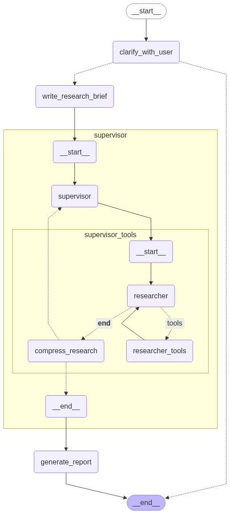

# 🔬 Deep Research

**Deep Research** — это мультиагентная система, разработанная для проведения глубоких исследований в различных областях. Она использует передовые технологии для анализа и структурирования информации, предоставляя пользователям детальные отчёты и рекомендации.

## 🚀 Основные функции

- **🎯 Уточнение** - Анализирует запросы пользователя, задаёт уточняющие вопросы при необходимости, преобразует диалог в чёткое исследовательское задание

- **🔄 Координационный агент** - Руководит работой множественных исследователей (под-агентов), планирует стратегию исследования, контролирует качество и полноту данных

- **🌐 Веб-исследования** - Проводит целенаправленный поиск в интернете, анализирует и суммирует веб-страницы, извлекает ключевые факты и цитаты

- **📋 Структурированная отчётность** - Создаёт подробные отчёты в формате Markdown, включает цитирование всех источников, организует информацию в логической последовательности

## 📦 Установка

### Предварительные требования
- **Python 3.11 или выше**
- **Poetry**

### Предустановка Poetry (если отсутствует)
```bash
pip install poetry
```

### Установка с Poetry

```bash
git clone https://github.com/avolxn/deep-research.git
cd deep-research

poetry install
```

## ⚙️ Настройка
Скопируйте файл example.env:
```bash
cp example.env .env
```

Отредактируйте `.env` файл, добавив ваши API ключи:
```env
GOOGLE_API_KEY = YOUR_GOOGLE_AI_STUDIO_API_KEY
TAVILY_API_KEY = YOUR_TAVILY_API_KEY
```

## 🔑 Получение API ключей

#### Google AI Studio API
> Gemini модель из Google AI Studio не поддерживается на территории Российской Федерации.
> Для получения API ключа и корректной работы модели необходимо использовать VPN.
1. 🌐 Перейдите на [Google AI Studio](https://aistudio.google.com/app/apikey)
2. ✨ Создайте новый API ключ
3. 📋 Скопируйте ключ в переменную `GOOGLE_API_KEY`

#### Tavily API
1. 📝 Зарегистрируйтесь на [Tavily](https://tavily.com/)
2. 🔐 Получите API ключ в личном кабинете
3. 📋 Скопируйте ключ в переменную `TAVILY_API_KEY`

### ▶️ Запуск

```bash
python main.py
```

## 💻 Использование

```
🤖 Добро пожаловать в Deep Research Agent!
Введите тему исследования (или '/exit' для выхода)

Тема исследования: 
```

**📝 Пример запроса пользователя:**
> 💡 Агент может задать дополнительные вопросы
```
Исследуй применение искусственного интеллекта в медицине в 2024 году
```

**📊 Пример подробного и структурированного отчета в файле [USAGE_EXAMPLE](USAGE_EXAMPLE.md).**

## 📷 Архитектура агента



## 🛠️ Технологический стек

- **LangGraph** - Фреймворк для построения агентов
- **LangChain** - Фреймворк для работы с языковой моделью
- **Tavily** - Веб-поиск
- **Google Gemini** - Языковая модель
- **Asyncio** - Асинхронное программирование
- **Pydantic** - Валидация данных, структурированный вывод

## 📊 Метрики системы и оптимизация

- **Время исследования:** 3-5 минут в зависимости от сложности темы исследования
- **Параллельная обработка:** До 15 источников одновременно благодаря асинхронности
- **Качество источников:** Приоритет первичных и авторитетных источников
- **Глубина анализа:** До 5 итераций поиска на под-агента
- **Охват информации:** Множественные источники с разных ракурсов
- **Автоматическая остановка**: Автоматически останавливается при достижении достаточного объёма информации
- **Сжатие найденной информации**: Сжимает результаты для более качественной генерации отчета

## 📄 Лицензия

Этот проект распространяется под лицензией **MIT**. Подробности в файле [LICENSE](LICENSE).
