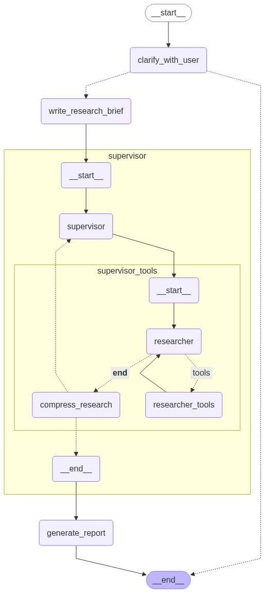

# 🔬 Deep Research

**Deep Research** — это мультиагентная система, разработанная для проведения глубоких исследований в различных областях. Она использует передовые технологии для анализа и структурирования информации, предоставляя пользователям детальные отчёты и рекомендации.

## 🚀 Основные функции

- **🔍 Уточнение** - Анализирует запросы пользователя, задаёт уточняющие вопросы при необходимости, преобразует диалог в чёткое исследовательское задание

- **🔄 Координационный агент** - Руководит работой множественных исследователей (под-агентов), планирует стратегию исследования, контролирует качество и полноту данных

- **🌐 Веб-исследования** - Проводит целенаправленный поиск в интернете, анализирует и суммирует веб-страницы, извлекает ключевые факты и цитаты

- **📊 Структурированная отчётность** - Создаёт подробные отчёты в формате Markdown, включает цитирование всех источников, организует информацию в логической последовательности

- **🔗 REST API** - Полнофункциональный API для интеграции с внешними сервисами и создания пользовательских интерфейсов

## 📦 Установка

### 🔧 Предварительные требования
- **Python 3.11+** и **Poetry** (для установки без Docker)
- **Docker и Docker Compose** (для установки с Docker)

```bash
# Клонировать репозиторий
git clone https://github.com/avolxn/deep-research.git
cd deep-research

# Настроить окружение
cp example.env .env
```

### 🧩 Отредактируйте `.env` файл. Обязательные параметры:

```env
# Ключи API
AGENT_GOOGLE_API_KEY=YOUR_GOOGLE_AI_STUDIO_API_KEY
AGENT_TAVILY_API_KEY=YOUR_TAVILY_API_KEY
```

## 🔑 Получение API ключей

### Google AI Studio API
> Модель Gemini недоступна на территории Российской Федерации.
> Для получения ключа и корректной работы модели используйте VPN.

1. Зарегистрируйтесь на [Google AI Studio](https://aistudio.google.com/app/apikey)
2. Получите API ключ в личном кабинете
3. Скопируйте ключ в переменную `AGENT_GOOGLE_API_KEY`

### Tavily API
1. Зарегистрируйтесь на [Tavily](https://tavily.com/)
2. Получите API ключ в личном кабинете
3. Скопируйте ключ в переменную `AGENT_TAVILY_API_KEY`

## ▶️ Запуск

### 🐳 С Docker

```bash
# Запуск всех сервисов
docker-compose up -d

# Просмотр логов
docker-compose logs api

# Остановка сервисов
docker-compose down
```

### 🧪 С Poetry

```bash
# Установка poetry (если отсутствует)
pip install poetry

# Установка зависимостей
poetry install

# Запуск сервиса
python -m deep_research.main
```

## 💻 Использование API

>🔗 API: `http://localhost:8000`

>📘 API Swagger UI: `http://localhost:8000/docs`

**Полная документация API доступна в [📄 docs/API.md](docs/API.md)**

## 📊 Примеры

**📄 Подробный пример работы системы с отчетом доступен в [📄 docs/EXAMPLE.md](docs/EXAMPLE.md)**

## 📷 Архитектура агента



## 🛠️ Технологический стек

### ML
- **LangGraph** - Фреймворк для построения мультиагентных систем
- **LangChain** - Фреймворк для работы с языковыми моделями
- **Google Gemini** - Языковая модель
- **Tavily** - Инструмент для веб-поиска

### Backend
- **FastAPI** - Фреймворк для создания REST API
- **SQLAlchemy** - ORM для работы с базой данных
- **PostgreSQL** - Реляционная база данных
- **Pydantic** - Валидация данных и настроек

### Infrastructure
- **Docker & Docker Compose** - Контейнеризация и оркестрация
- **Poetry** - Управление зависимостями Python

## 📈 Метрики системы и оптимизация

- **Время исследования:** ~5 минут на исследование в зависимости от сложности темы исследования
- **Параллельная обработка:** До 15 источников одновременно благодаря асинхронности
- **Качество источников:** Приоритет первичных и авторитетных источников
- **Глубина анализа:** До 5 итераций поиска на агента-исследователя
- **Охват информации:** Множественные источники с разных ракурсов
- **Автоматическая остановка:** Автоматически останавливается при достижении достаточного объёма информации
- **Сжатие найденной информации:** Сжимает результаты для более качественной генерации отчета

## 🏗️ Структура проекта

```
deep-research/
├── docs/
│   ├── API.md                         # Документация REST API
│   ├── EXAMPLE.md                     # Пример использования
│   └── graph.png                      # Схема архитектуры
├── src/
│   └── deep_research/
│       ├── backend/                   # FastAPI приложение
│       │   ├── app.py                 # Точка входа FastAPI
│       │   ├── router.py              # API endpoints
│       │   ├── models.py              # SQLAlchemy модели
│       │   ├── schemas.py             # Pydantic схемы
│       │   ├── service.py             # Бизнес-логика
│       │   └── database.py            # Настройка БД
│       ├── ml/                        # ML агенты
│       │   ├── graph.py               # Основной граф
│       │   ├── supervisor_subgraph.py # Граф супервизор-агента
│       │   ├── researcher_subgraph.py # Граф исследовательского агента
│       │   ├── state.py               # Состояние агентов
│       │   ├── tools.py               # Инструменты агентов
│       │   ├── prompts.py             # Промпты
│       │   └── utils.py               # Инициализация LLM
│       ├── config.py                  # Конфигурация
│       └── main.py                    # Запуск приложения
├── docker-compose.yml
├── Dockerfile
├── pyproject.toml
├── .env
└── README.md
```

## 📄 Лицензия

Этот проект распространяется под лицензией **MIT**. Подробности в файле [LICENSE](LICENSE).