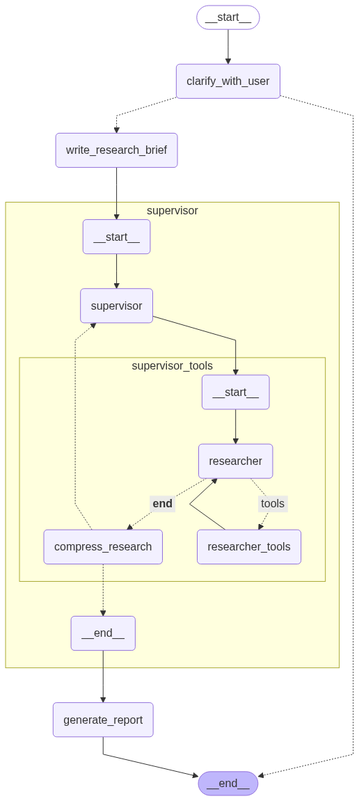

# 🔬 Deep Research

**Deep Research** — мультиагентная система для проведения глубоких исследований с real-time стримингом прогресса. Использует Yandex GPT и Tavily Search для анализа и структурирования информации.

## 🚀 Основные функции

- **🔍 Уточнение** — анализирует запросы, задаёт уточняющие вопросы, формирует исследовательское задание
- **🔄 Координационный агент** — руководит под-агентами, планирует стратегию, контролирует качество данных
- **🌐 Веб-исследования** — поиск в интернете, анализ и суммаризация веб-страниц
- **📊 Структурированная отчётность** — Markdown отчёты с цитированием источников
- **⚡ Real-time стриминг** — SSE эндпоинты для отслеживания прогресса исследования в реальном времени

## 📦 Установка

### Предварительные требования

- **Python 3.11+** и **Poetry** (локальная установка)
- **Docker и Docker Compose** (контейнеризация)

```bash
git clone https://github.com/avolxn/deep-research.git
cd deep-research
cp .env.example .env
```

### Настройка `.env`

```env
# Yandex GPT
AGENT_YANDEX_GPT_API_KEY=your_api_key
AGENT_YANDEX_GPT_FOLDER_ID=your_folder_id

# Tavily Search
AGENT_TAVILY_API_KEY=your_tavily_key
```

## 🔑 Получение API ключей

### Yandex GPT

1. Создайте сервисный аккаунт в [Yandex Cloud Console](https://console.yandex.cloud/)
2. Получите API ключ и Folder ID
3. Добавьте в `.env`

### Tavily API

1. Зарегистрируйтесь на [Tavily](https://tavily.com/)
2. Получите API ключ в личном кабинете

## ▶️ Запуск

### 🐳 Docker

```bash
docker-compose up -d
docker-compose logs -f api
```

### 🧪 Poetry (локально)

```bash
poetry install
poetry run uvicorn deep_research.app:app --reload
```

## 💻 API

- **Base URL:** `http://localhost:8000`
- **Swagger UI:** `http://localhost:8000/docs`

### Эндпоинты

| Метод | Путь                           | Описание                                          |
| ---------- | ---------------------------------- | --------------------------------------------------------- |
| `POST`   | `/research`                      | Создать сессию исследования      |
| `GET`    | `/research/{id}/stream`          | **SSE** стриминг прогресса         |
| `GET`    | `/research/{id}`                 | Получить результат                       |
| `POST`   | `/research/{id}/continue`        | Ответить на уточняющие вопросы |
| `POST`   | `/research/{id}/continue/stream` | **SSE** стриминг продолжения     |
| `GET`    | `/research`                      | Список всех исследований            |

### SSE события

| Событие      | Описание                                                         |
| ------------------- | ------------------------------------------------------------------------ |
| `status`          | Изменение статуса исследования               |
| `research_result` | Промежуточные результаты исследования |
| `clarification`   | Уточняющий вопрос от агента                      |
| `report`          | Финальный отчёт                                            |
| `done`            | Исследование завершено                              |
| `error`           | Ошибка                                                             |

## 📷 Архитектура



## 🛠️ Технологический стек

| Категория       | Технологии                           |
| ------------------------ | ---------------------------------------------- |
| **ML**             | LangGraph, LangChain, Yandex Cloud, Tavily     |
| **Backend**        | FastAPI, SQLAlchemy, PostgreSQL, SSE-Starlette |
| **Infrastructure** | Docker, Poetry                                 |

## 🏗️ Структура проекта

```
deep-research/
├── src/deep_research/
│   ├── agent/
│   │   ├── graph.py              # Основной граф LangGraph
│   │   ├── supervisor_subgraph.py
│   │   ├── researcher_subgraph.py
│   │   ├── state.py
│   │   ├── tools.py
│   │   ├── prompts.py
│   │   ├── config.py
│   │   └── utils.py
│   ├── app.py                    # FastAPI приложение
│   ├── router.py                 # API эндпоинты
│   ├── service.py                # Бизнес-логика + стриминг
│   ├── models.py                 # SQLAlchemy модели
│   ├── schemas.py                # Pydantic схемы
│   ├── database.py
│   └── config.py
├── docs/
├── docker-compose.yml
├── Dockerfile
├── pyproject.toml
└── .env.example
```

## 📄 Лицензия

MIT — см. [LICENSE](LICENSE)
